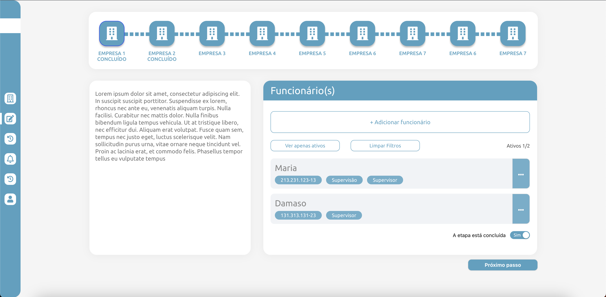

# SEA Tecnologia

Projeto técnico do Processo Seletivo da SEA Tecnologia



## Descrição

A principal página desenvolvida para o projeto foi baseado no protótipo do [Figma](https://www.figma.com/file/gGePjuPTHdH7pISofjrzxB/Desafio-React?type=design&node-id=8-8&t=FX1K5qxoaUjWtxu8-0), que é a página de CRUD de Funcionários.

Outras páginas foram adicionadas para exibir a funcionalidade de navegação, porém não possuem conteúdo interno.

## Tecnologias utilizadas

Foram utilizadas algumas tecnologias para o desenvolvimento desse projeto, que estão listadas abaixo com suas respectivas descrições:

- json-server : Mock de API.
- Ant Design: Biblioteca de estilos do React, foi utilizado principalmente para certa organização de alguns componentes, como modal, botões dropdown, etc.
- Formik: Biblioteca de controle de formulários, foi utilizado para realizar a organização e validação do formulário de criação e edição de funcionários.
- Redux: Biblioteca de controle de estados, foi utilizado para o controle de dados carregados da API pela aplicação, além de controlar o estado dos elementos principais ao realizar modificações na API ou na próprio aplicação.
- SASS: Extensão de linguagem do CSS que realiza uma organização mais criteriosa dos arquivos de estilo.
- TypeScript: Linguagem oriunda do JavaScript que tem um alto poder de linguagem, utilizado nesse projeto para facilitar o desenvolvimento.
- Yup: Biblioteca de validação que é utilizado em conjunto com o Formik.

## Funcionalidades

É possível nesse projeto: 

- Criar funcionários.
- Deletar funcionários.
- Editar funcionários.
- Filtrar funcionários ativos.
- Acessar listagem de funcionários e descrição de várias empresas.
- Editar propriedade da empresa, se a "Etapa está concluida" ou não.

## Como executar

Para rodar o projeto, basta executar os seguintes comandos:

```
$ git clone https://github.com/juniopereirab/SEA_Tecnologia
$ cd SEA_Tecnologia
$ yarn install  # Será instalado as dependências
$ yarn start
```

Além disso é necessário executar a API Mock criada com o json-server, para isso, basta rodar os seguintes comandos, na pasta raiz do projeto:

```
$ json-server api/db.json -p 8000
```

A flag `-p` é necessário para a configuração da porta que será executado a API, caso seja escolhida uma porta diferente, lembre-se de alterar o arquivo [.env](./.env).

Obs.: É necessário ter o json-server instalado, caso não tenha instalado na sua máquina, basta executar o comando:

```
npm install -g json-server
```
